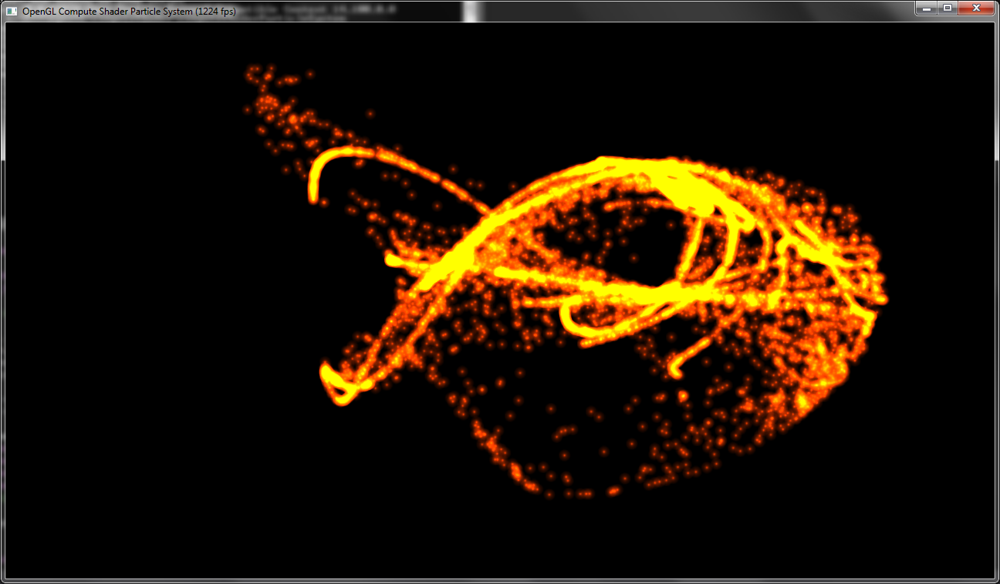
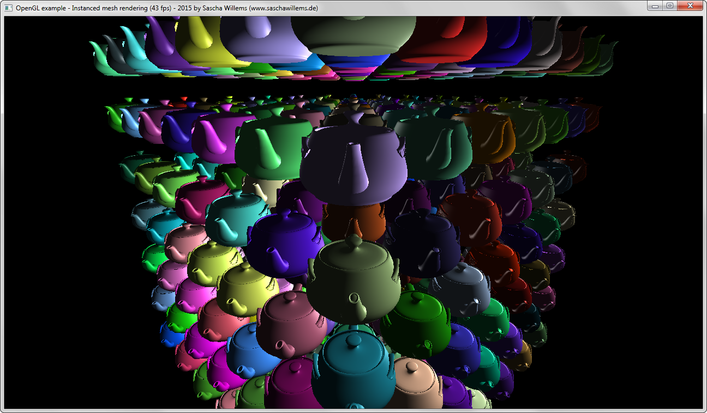
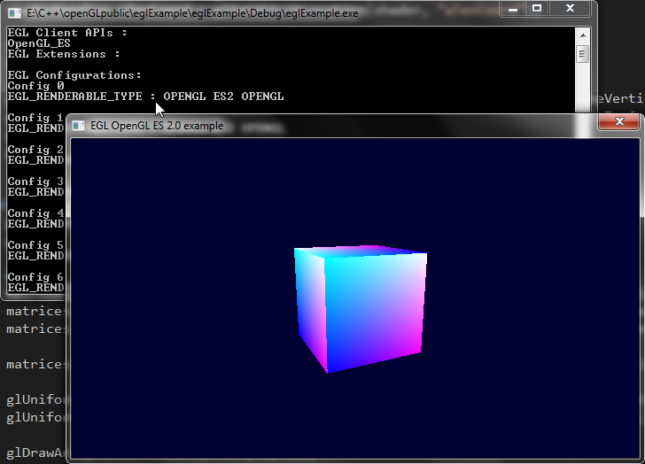

# C++ OpenGL samples and demos

This repository contains sources for assorted OpenGL samples and demos written in C++.

This is more or less a collection of OpenGL stuff I did for quick testing, so no CMake, no cross platform and not much source documentation.

Use at your own risk ;)

# Samples

## Compute shader particle system
</a>

Attraction based compute shader particle system using SSBOs.

## Instancing
</a>

Mesh instancing (OpenGL 3.3+) demo. Made to compare against the same Vulkan example.

## EGL
</a>

Shows how to use EGL for setting up OpenGL ES 2.0 on a windows desktop. Only works for vendors that support EGL on desktop.

## Geometry shader
Very simple geometry shader demo.

## Simple STL viewer
A very basic demo for loading and displaying a .stl file.
